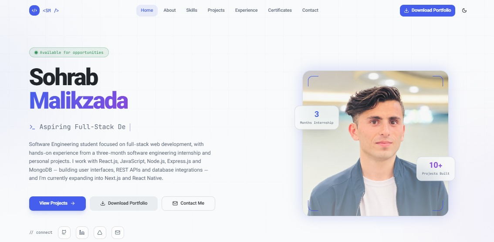

# Sohrab Malikzada — Full-Stack Developer Portfolio

A modern, responsive personal portfolio website showcasing my background, technical skills, projects, education, experience, and certifications as a Software Engineering student and aspiring Full Stack Web Developer.


🌐 **Live Portfolio:** https://sohrabmalikzada.vercel.app/

🌍 Live Demo

🔗 Live Website:
<p align="center">
  <a href="https://sohrabmalikzada.vercel.app" target="_blank">
    
  </a>
</p>

💻 **GitHub:** https://github.com/Sohrab-Malikzada

---

## Overview

This portfolio was built to provide a professional overview of my development journey and selected projects.

It highlights my experience with modern web technologies, full-stack development, responsive UI design, API integration, database-driven applications, and continuous learning.

The website is designed with a focus on:

* Clean and modern user interface
* Responsive design across desktop, tablet, and mobile
* Clear presentation of technical skills and projects
* Accessible and intuitive navigation
* Performance-conscious implementation
* Professional developer branding

---

## Features

* Responsive portfolio layout
* Modern landing page
* About section
* Technical skills showcase
* Education section
* Professional experience section
* Projects showcase
* Certifications section
* Contact section
* Responsive navigation
* Modern UI components
* Dark and light theme support
* Mobile-friendly design
* Smooth animations and interactions
* Live project links
* GitHub repository links

---

## Tech Stack

### Frontend

* React.js
* TypeScript
* Vite
* Tailwind CSS
* shadcn/ui

### Development & Deployment

* Git
* GitHub
* npm
* Vercel

---

## Project Structure

The project follows a component-based React architecture designed to keep the application maintainable and scalable.

```text
src/
├── components/
│   ├── portfolio/
│   └── ui/
├── pages/
├── assets/
├── App.tsx
├── main.tsx
└── index.css
```

The structure may evolve as the project continues to be improved and expanded.

---

## Getting Started

### Prerequisites

Make sure you have the following installed:

* Node.js
* npm
* Git

### Clone the Repository

```bash
git clone https://github.com/Sohrab-Malikzada/portfolio.git
cd portfolio
```

### Install Dependencies

```bash
npm install
```

### Start Development Server

```bash
npm run dev
```

The application will be available locally through the development server.

### Build for Production

```bash
npm run build
```

### Preview Production Build

```bash
npm run preview
```

---

## Development Workflow

The project is maintained using Git and GitHub for version control.

Typical workflow:

```bash
git pull
git add .
git commit -m "Update portfolio"
git push
```

Production deployments are connected to the GitHub repository through Vercel.

---

## Deployment

The portfolio is deployed and publicly accessible through Vercel.

**Live Website:**
https://sohrabmalikzada.vercel.app/

Every production update can be deployed through the connected GitHub repository.

---

## What This Project Demonstrates

This project demonstrates practical experience with:

* React component architecture
* TypeScript development
* Responsive web design
* Tailwind CSS
* Reusable UI components
* Modern frontend development practices
* Git and GitHub workflows
* Production deployment
* Performance and responsive considerations
* Building and maintaining a real-world personal web application

---

## Continuous Improvement

This portfolio is an ongoing project. I continuously improve its design, performance, accessibility, content, and technical implementation as I learn new technologies and develop new projects.

---

## About Me

I am a Computer Science student specializing in Software Engineering with a strong interest in Full Stack Web Development.

My current focus is on building practical web applications using:

**React.js · Node.js · Express.js · MongoDB**

I am also expanding my knowledge of **Next.js** and **React Native** while continuing to strengthen my software engineering fundamentals.

---

## Contact

If you are interested in my work, collaboration opportunities, internships, or junior developer positions, feel free to connect with me through my portfolio or GitHub.

🌐 **Portfolio:** https://sohrabmalikzada.vercel.app/

💻 **GitHub:** https://github.com/Sohrab-Malikzada
